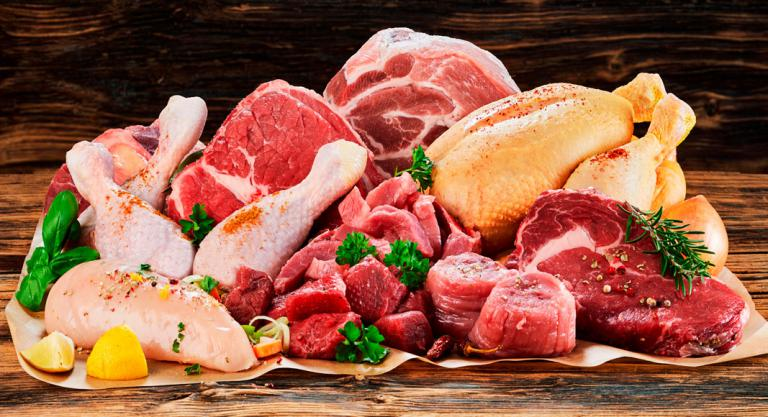

# Anlisis del consumo de carne en el mundo

- **Objetivo:** Analizar el consumo de carne en el mundo.
- **Fuente:** [Consumo mundial de carne](https://www.kaggle.com/datasets/allenkong/worldwide-meat-consumption)

    
Imagen de https://www.agronewscomunitatvalenciana.com/

El consumo de carne es uno de los aspectos más importantes de la alimentación humana y una fuente clave de proteínas y otros nutrientes. Sin embargo, el consumo de carne a nivel mundial ha sido objeto de un intenso debate en los últimos años debido a su impacto ambiental y a los posibles riesgos para la salud.

En este contexto, el análisis de consumo de carne a nivel mundial es una herramienta valiosa para comprender los patrones de consumo de carne y sus implicaciones en términos de salud y sostenibilidad. El análisis de datos de consumo de carne a nivel mundial también puede proporcionar información sobre las tendencias de consumo y los factores que influyen en la elección de alimentos en diferentes países.

A través del análisis de datos, es posible identificar patrones de consumo de carne en diferentes regiones del mundo, examinar las preferencias de consumo de diferentes tipos de carne y evaluar las implicaciones del consumo de carne para la salud y el medio ambiente. También se puede analizar cómo el consumo de carne varía según el nivel de ingresos de los países, la cultura alimentaria y los factores socioeconómicos.

En definitiva, el análisis de consumo de carne a nivel mundial puede proporcionar información valiosa para los responsables de la formulación de políticas, los investigadores y los consumidores interesados en tomar decisiones informadas sobre su alimentación y su impacto en el medio ambiente.
 
* **Autora:** [Elisabeth Pérez](https://www.linkedin.com/in/elisabethperezruiz)
  
* **Fecha:** 03/05/2023

* **Código:** [GitHub](https://github.com/ElisabethDATA/informe-carne)

* **Datos:** [GitHub](https://raw.githubusercontent.com/ElisabethDATA/informe-carne/master/data/meat_consumption.csv)
